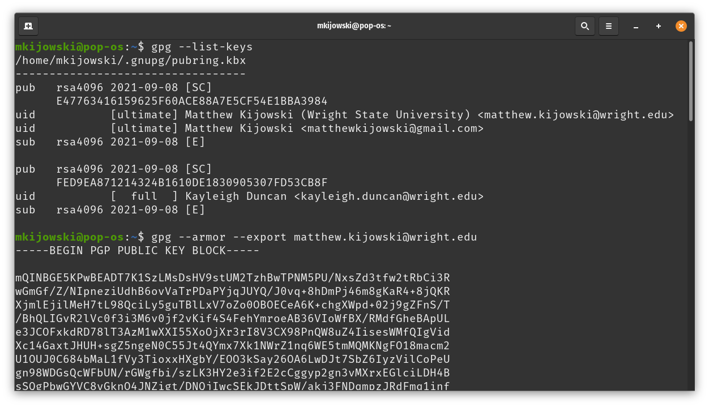

# It's going to be a lame party isn't it...


---

## We dont actually use scytales anymore for encryption...

But we still use symmetric encryption 

* *Same key* for **encrypt** and **decrypt**

But today we are going to talk about asymmetric encryption

* *Different keys* for **encrypt** and **decrypt**

---

## Asymmetric encryption

Two keys (at least) that are mathematically related.

* **Public key**
  * known to the public (everyone)
  * can **encrypt** messages that only the *private key* can **decrypt**
  * can **decrypt** messages the *private key* **encrypts**
* **Private key**
  * known only to you (or the owner)
  * can **encrypt** messages only the *public key* can **decrypt**
  * can **decrypt** messages the *public key* **encrypts**

---

## Building our own Web of Trust

Today we are going to build a (small) web of trust by having each of you 
do the following:

1. Create public and private keys with: `gpg --full-generate-key`
2. Check (and write down) your fingerprint: `gpg --fingerprint <email>` 
3. `gpg -o mykey.gpg --export <email>` OR `gpg -o mykey.txt --armor --export <email>`  (this last one gets you a plain text file)
4. Exchange emails and fingerprints (and trust)
5. Exchange public keys via email (or other means)
6. `gpg --import <their-key-file>`
7. After this we have options:
  * Sign each others keys
  * encrypt a message and send it
  * sign a message with your key

---

## Getting started


`gpg --full-generate-key`

* Select the default keys to make (option 1)
* Use your real name and email!
* Use all the bits (4096)!
* Feel free to set an expiration of 1 (day) to 0 (no expiration)
* Use a password that you will not forget!
* If you would like upload said key to a key server:

```
     gpg --export <your_email_address@example.net> | curl -T - https://keys.openpgp.org
```

---

# I have a key, now what?



* Get fingerprint with: `gpg --fingerprint matthew.kijowski@wright.edu`
* Convince your table mates that you are the person with the given email and share your fingerprint!
* Exchange emails and key fingerprints

---

## Importing public keys

* `gpg --import kijowski.gpg`

Check to make sure the fingerprint matches: 

```
E477 6341 6159 625F 60AC  E88A 7E5C F54E 1BBA 3984
                               7E5C F54E 1BBA 3984
```

---

## Signing someone's key

Signing a key simply puts your digital signature on their key, implying
that you have some trust that the person that the key belongs to is who
they say they are.  People who trust you will recognize your signature
on other people's keys, increasing trust without having to have actually 
met in person.

* `gpg --edit-key matthew.kijowski@wright.edu`
* `sign`
* `save`
* `gpg --armor --export matthew.kijowski@wright.edu`

---

# Signed sealed delivered

Lets sign a message!

* Create a `sample.txt` file with a public message (Hello World or some such thing).
* `gpg --sign sample.txt`
* share the output sample.gpg with someone you exchanged keys with
* `cat` the output file, can you read the contents?
* `gpg --verify sample.gpg`

---

# Now for some fun

Lets send a secret message!

* Create a text file `secret-message.txt`
* Choose someone you have exchanged keys with
* Encrypt the file: `gpg --output secret-message.gpg --encrypt --recipient their.email@wright.edu`
* Send them `secret-message.txt` via email or discord
* The recipient can decrypt with:
  * `gpg --output secret.txt --decrypt secret-message.gpg`


--- 

# Back up your gpg keys!!!

`tar -cpzf gnupg.tar.gz ~/.gnupg/`

if you are using a Wright State laptop

`cp gnupg.tar.gz /mnt/c/Users/student/Desktop/`

Save this file!!!

You can also backup your private key and any public keys with:

* `gpg --armor --export-secret-key your.email@wright.edu`
* `gpg --armor --export your.email@wright.edu`
* `gpg --armor --export friends@wright.edu`

---

## Useful links:

[GPG Downloads page](https://gnupg.org/download/)


